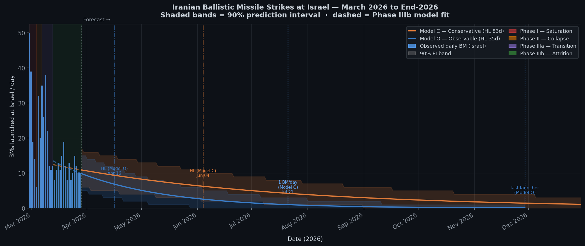
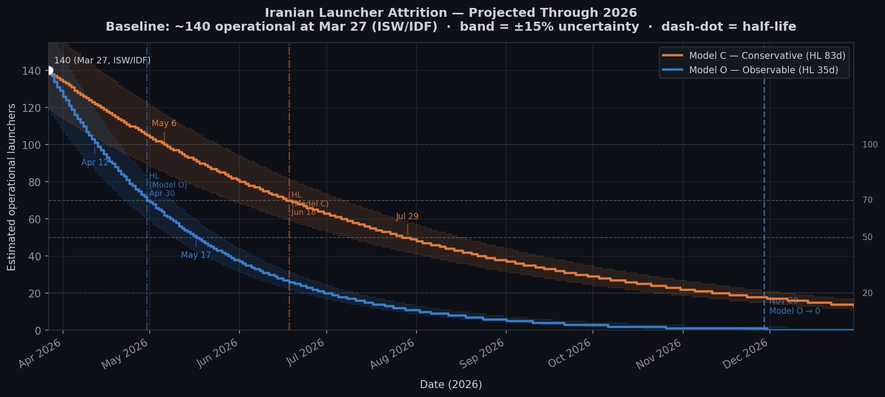
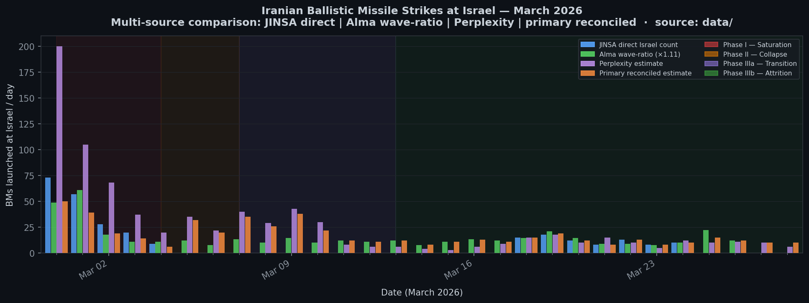

# iran-bm-forecast

**Statistical analysis and April 2026 forecast of Iranian ballistic missile strikes on Israel.**

Built during the 2026 Iran–Israel war to answer a specific question: not how many missiles Iran has fired, but what its *underlying launch capacity* looks like — and where it is heading.

---

## The Story

Iran's ballistic missile campaign against Israel opened on February 28, 2026 with a brief, overwhelming saturation offensive: 14–50 BMs/day at Israel, over 100/day globally, drawing on the highest-readiness launcher inventory in a pre-planned mass launch. Within four days it was over. By Day 5 the rate was collapsing. By Day 14 (March 13) something more durable had emerged: a stable, low-rate, slowly decaying stochastic regime running at ~10–12 BMs/day.

The statistical signature of that regime is striking. Daily launch counts follow a **Poisson distribution with exponential decay** — the mathematical fingerprint of a large population of independent nodes each failing at a fixed daily rate. The textbook analogue is radioactive decay. The military analogue is a distributed launcher network where each node operates autonomously, fires when local conditions allow, and has a fixed daily probability of being destroyed or suppressed by Israeli strikes.

Three structural conclusions follow from the data:

1. **Launches are statistically independent.** No detectable autocorrelation, no coordination signal, no pause-and-surge cycles. The most parsimonious explanation is that surviving launcher nodes operate without central daily scheduling.

2. **The stockpile is not the binding constraint.** If Iran were drawing from a nearly exhausted missile inventory, firing more today would suppress tomorrow — producing negative autocorrelation. None detected. The binding constraint is operational launcher capacity, not missiles in storage.

3. **Capacity is decaying at 0.83–2.0% per day** — a half-life of **35–83 days**. Under Model O the half-life is reached by April 17 and the rate falls below 1 BM/day by July 22, with the last effective launcher depleted by late November 2026. Under Model C the half-life isn't reached until June 6 and the campaign remains above 1 BM/day through year-end. The campaign will not collapse on its own in the near term, but it is eroding — and under the faster scenario it has a natural endpoint within 2026.

For the full operational analysis, see [docs/iran_bm_capabilities.md](docs/iran_bm_capabilities.md).

---

## The Model

The forecasting model is a **Poisson process with exponential decay**:

```
L_t ~ Poisson(μ_t),   μ_t = μ₀ · exp(−α · (t − t₀))
```

where `L_t` is the daily BM count at Israel on war day `t`, `μ₀` is the rate at the Phase IIIb anchor (Day 14, Mar 13), and `α` is the decay rate.

The key design choice is **decoupled calibration**: the Poisson process structure is fitted to Phase IIIb launch data (Days 14–29), while the decay rate `α` is fixed externally for each scenario. This prevents daily Poisson noise from distorting the decay estimate and reduces April forecast uncertainty from ±72 BMs to ±15 BMs.

Two scenarios bracket the plausible range:

| Model | α | Half-life | Source |
|-------|---|-----------|--------|
| **Observable (O)** | 0.020/day | 35 days | Weighted log-linear regression on Phase IIIb weekly aggregates (Poisson GLM) |
| **Conservative (C)** | 0.0083/day | 83 days | Published intelligence on total launcher counts (160→140, Days 12–28) |

**Model O** is a projection of current conditions: it captures all factors suppressing Iran's output — physical launcher destruction, crew attrition, logistics degradation, coordination disruption. It holds as long as those underlying parameters don't materially change.

**Model C** is derived independently from physical launcher counts. It is slower because intelligence counts only destroyed launchers, not operational suppression. It can materialise if Iran resolves its operational constraints and brings dormant launchers back into rotation.

Reality is expected between them. Full derivations and diagnostics are in [docs/methodology.md](docs/methodology.md).

---

## April 2026 Forecast



> **Generated March 29, 2026** — one month into the war, before any April data was observed. These are live predictions, not post-hoc analysis.

| Model | Half-life | April total | 90% PI | Daily rate Apr 29 |
|-------|-----------|------------|--------|-------------------|
| **Conservative (C)** | 83 days | **~275 BMs** | [248–302] | ~8.4/day |
| **Observable (O)** | 35 days | **~206 BMs** | [182–229] | ~5.3/day |
| Midpoint | ~50 days | **~240 BMs** | — | ~7/day |

Weekly breakdown (Model C / Model O):

| Week | Dates | Model C | Model O | Weekly decline |
|------|-------|---------|---------|----------------|
| 1 | Mar 29–Apr 4 | 74.3 | 64.8 | — |
| 2 | Apr 5–11 | 70.1 | 56.3 | −5.6% / −13.1% |
| 3 | Apr 12–18 | 66.2 | 49.0 | −5.6% / −13.1% |
| 4 | Apr 19–25 | 62.4 | 42.6 | −5.6% / −13.1% |
| 5 | Apr 26–29 | 34.1 | 21.8 | (4 days) |

The weekly decline is constant in percentage terms — a direct consequence of exponential decay. Model C loses ~5.6%/week; Model O loses ~13.1%/week.

The model discrimination checkpoint is **April 15–18**: by then, 18–21 days of April data provide 80–90% statistical power to determine which model better reflects reality.

---

## Launcher Attrition Outlook



Starting from the intelligence-confirmed baseline of ~140 operational launchers (Day 28, Mar 27):

| Threshold | Model C | Model O |
|-----------|---------|---------|
| 100 launchers | May 6, 2026 | Apr 12, 2026 |
| 70 launchers | Jun 18, 2026 | Apr 30, 2026 |
| 50 launchers | Jul 29, 2026 | May 17, 2026 |
| 20 launchers | Nov 16, 2026 | Jul 2, 2026 |

Under Model O, Iran falls below 50 effective launcher-equivalents by mid-May. Under Model C, the same threshold is not reached until late July. These projections assume no structural change in Israeli strike effectiveness or Iranian adaptation.

---

## Running the Model

```bash
# Install dependencies
pip install numpy scipy matplotlib

# Daily forecast table + weekly summary
python model/poisson_model.py

# Phase IIIb back-test (Z-score monitoring)
python model/poisson_model.py --backtest

# Full model comparison, AIC table, diagnostics
python model/model_diagnostics.py
```

Forecast output is written to `predictions/predictions.csv`.

```bash
# Generate figures
python model/plot_figures.py
```

---

## Repository Structure

```
iran-bm-forecast/
├── model/
│   ├── poisson_model.py       # Main forecast model (Models C and O)
│   ├── model_diagnostics.py   # Model selection, AIC, overdispersion, autocorrelation
│   └── plot_figures.py        # README figures (timeline, launcher depletion, data)
├── docs/
│   ├── iran_bm_capabilities.md  # Operational analysis and conclusions
│   └── methodology.md           # Full statistical specification
├── data/
│   ├── israel_daily_estimate.csv      # Primary model input: daily BM estimates at Israel
│   ├── all_sources_daily.csv          # Raw source columns (JINSA/IDF/Alma/Perplexity)
│   ├── inventory.csv                  # BM/launcher stock snapshots
│   └── sources/alma/waves_daily.csv   # Alma attack-wave counts (independent cross-check)
├── figures/
│   ├── fig1_launch_timeline.png
│   ├── fig2_launcher_depletion.png
│   └── fig3_march_data.png
└── predictions/
    └── predictions.csv        # Model output: daily forecasts + 90% PIs for April 2026
```

---

## Data



Daily BM estimates at Israel (`data/israel_daily_estimate.csv`) are constructed from multiple open sources using a source hierarchy: JINSA direct counts → JINSA-derived (global minus confirmed non-Israel) → Alma wave-ratio estimates. Each day carries a `data_type` field (observed / observed\_partial / derived / proxy\_est) and a `method` field documenting the specific calculation.

Primary sources:

- **JINSA** (Jewish Institute for National Security of America) — PDF reports with per-country BM counts; most authoritative for Days 11–27
- **IDF / Israeli media** — cumulative anchor confirmations (128 by Mar 4, ~300 by Mar 10, >450 by Mar 27); N12/Ynet liveblogs for late March
- **Alma Research and Education Center** — daily Iran-origin attack wave counts toward Israel; used as wave-ratio proxy for Days 12–18 and as independent cross-check for decay rate estimation
- **ISW** (Institute for the Study of War) — launcher count assessments; basis for Model C's α derivation
- **BBC Arabic / IDF** — Phase I BBC/IDF anchor (~128 BMs at Israel by Day 5)

Full data provenance, anchor constraints, and estimation methodology are documented in [docs/methodology.md](docs/methodology.md).
